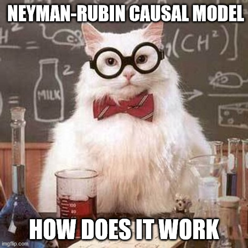

```{marginfigure}

```

<style>
body {
text-align: justify}
</style>

```{r setup, include=FALSE, results='hide', warning=FALSE}
library(knitr)
opts_chunk$set(cache = FALSE,
               echo = TRUE,
               message = FALSE,
               warning = FALSE,
               dev = "CairoPNG",
               dpi = 300)  
``` 

The goal of this document is to introduce you to the Neyman-Rubin Causal Model and its use in the context of randomized controlled trials. The beauty of the Neyman-Rubin Causal is to clearly formalize the fundamental problem of causal of inference: we can never observe all the potential outcomes of a given unit. Causal inference is inherently a missing data problem. Randomized controlled trials, by randomly allocating the treatment, allow to create groups which have similar potential outcomes outcomes. Contrary to most observational studies, the random allocation makes the treatment independent of the potential outcomes: a simple difference in means can be computed to estimate the average causal effect of the treatment. In the next classes, we will see how we can still try to draw causal conclusions in the context of observational studies.

The document is organized as follows:

* in the first section, we use a very simple simulation to show the balancing property of the random allocation of the treatment.
* in the second section, we present mode of inference proposed by Ronald Fisher to analyze the result of a RCT.
* in the last section, we present the alternative and less restrictive mode of inference proposed by Jerzy Neyman.


Should you have any questions or find errors, please do not hesitate to reach me at leo.zabrocki@psemail.eu.

# Loading Packages

To reproduce exactly the `script_rcm.html` document, we first need to have installed:

* the [R](https://www.r-project.org/) programming language 
* [RStudio](https://rstudio.com/), an integrated development environment for R, which will allow you to knit the `script_rcm.html` file and interact with the R code chunks
* the [R Markdown](https://rmarkdown.rstudio.com/) package
* and the [tint](https://eddelbuettel.github.io/tint/tintHTML.html) package which provides the template for this document. [tint](https://eddelbuettel.github.io/tint/tintHTML.html) is based on the amazing books on data visualizing written by Edward Tufte.

Once everything is set up, we load the following packages:

```{r}
library(here) # for file paths management
library(knitr) # for generating dynamic report
library(tidyverse) # for data manipulation and visualization
library(RcppAlgos) # for computing permutations matrix
source(here::here("script_theme_tufte.R")) # custom ggplot theme

# my custom colors
my_blue <- "#0096c7"
my_orange <- "#ff9100"
```

# Letting randomness create similar groups

For drawing causal inference, the incredible strength of randomized controlled trials lies in their capably to create similar treated and control groups. On average, observed but also **unoberserved** covariates will have the same distribution across the two groups. We can illustrate this property using a small simulation where:

* 100 units are randomly divided in a treatment group and a control group.
* each unit has 4 covariates, two of which are not observed by researchers.

We first simulate the dataset:

```{r}
# small simulation to illustrate
# the balancing property of rct

# set sample size
sample_size <- 1000

data_balance <- tibble(
  id = 1:sample_size,
  treatment = c(rep(0, sample_size/2), rep(1, sample_size/2)),
  variable_observed_1 = rnorm(n = sample_size, mean = 100, sd =5),
  variable_observed_2 = rpois(n = sample_size, lambda = 200),
  variable_unobserved_1 = rnorm(n = sample_size, mean = 800, sd = 30),
  variable_unobserved_2 = rpois(n = sample_size, lambda = 20)
)
```

Then, we randomly allocate the treatment and draw the distribution of each covariate for the treated and control groups:

```{r, fig.fullwidth = TRUE, fig.width = 10, fig.height = 5}
# checking balance
graph_balance <- data_balance %>%
  # random allocation of the treatment
  mutate(treatment = sample(treatment, replace = FALSE)) %>%
  pivot_longer(
    cols = c(variable_observed_1:variable_unobserved_2),
    names_to = "covariate",
    values_to = "value"
  ) %>%
  mutate(
    covariate = case_when(
      covariate == "variable_observed_1" ~ "Observed Covariate 1",
      covariate == "variable_observed_2" ~ "Observed Covariate 2",
      covariate == "variable_unobserved_1" ~ "Unobserved Covariate 1",
      covariate == "variable_unobserved_2" ~ "Unobserved Covariate 2"
    ),
    treatment = ifelse(treatment == 1, "Treated", "Control")
  ) %>%
  ggplot(., aes(x = value, colour = treatment)) +
  geom_density() +
  scale_color_manual(values = c(my_blue, my_orange)) +
  facet_wrap( ~ covariate, scales = "free_x", nrow = 1) +
  theme_tufte() +
  labs(
    title = "Checking Covariates Balance",
    x = "Covariate's Values",
    y = "Density",
    color = "Group:"
  )

# save the graph
ggsave(
  graph_balance,
  filename = here::here("outputs", "graph_balance.pdf"),
  width = 25,
  height = 12,
  units = "cm",
  device = cairo_pdf
)
```

We can see that randomization approximately balances observed and unobserved covariates.

# Fisherian Inference

## The theory behind this mode of inference

What is randomization inference (RI)? As explained by Fisher, the random allocation is used as the "reasoned basis for inference".

This mode of inference starts from a very strong assumption, called the **sharp null hypothesis**, where we assume that the treatment has no effect for all units. This assumption is obviously not realistic since even if we use a very inefficient treatment, it could still have a positive effect for some units. The statistician Donald Rubin explains that this can be nevertheless useful to test this hypothesis since if we cannnot reject it, it means that our treatment of interest is really inefficient. Another advantage of RI is that we do not rely on statistical theory to draw our inference upon: we do not make any asymptotic assumption and distributional form assumption for our test statistic.

Formally, the sharp null hypothesis is stated as:

$\forall i, H_{0} : \tau_{i} = Y_{i}(1) - Y_{i}(0) = 0$

We assume that for each unit, its Y(0) is equal to its Y(1). This hypothesis therefore allows ut to impute the missing potential outcomes.

To illustrate how this mode of inference, let's take a fictitious example proposed by Tirthankar Dasgupta and Donald B. Rubin (2022) of an agricultural experiment. The toy example consists in $N = 11$ observations of fields which were randomly allocated to two fertilizers, a new one and a standard one. The $N_{T} = 6$ fields which receive the new fertilizer will be the treated units and the $N_{C} = 5$ remaining ones are the control units. For each field, the yield of tomatos (in pounds) was measured at the end of the experiment.

We create the data of the experiment below:

```{r}
# create the data
data <- tibble(
    w = c(0, 0, 1, 1, 0, 1, 1, 1, 0, 0, 1),
    yield = c(29.2, 11.4, 26.6, 23.7, 25.3, 28.5, 14.2, 17.9, 16.5, 21.1, 24.3)
  )
```

We display below the Science Table, that is to say the table which contains for each field, its index, its treatment allocation, and the information on its two potential outcomes:

```{r, echo = FALSE}
data %>%
  mutate("Y(0)" = ifelse(w==0, yield, "?"),
         "Y(1)" = ifelse(w==1, yield, "?")) %>%
  rename(W = w, "Observed Yield" = yield) %>%
  select(W, "Y(0)", "Y(1)", "Observed Yield") %>%
  kable(., align = rep("c", 4))
```

## Testing the sharp null hypothesis of no effect

We first compute the total number of random allocations possible:

\begin{equation}
\frac{N!}{N_{T}!N_{C}!}
\end{equation}

With R, we can compute this number using the following code:

```{r}
n_allocations <- factorial(11)/(factorial(5)*factorial(6))

n_allocations
```

There are 462 allocations! The code below computes the permutation matrix:

```{r}
permutations_matrix <- RcppAlgos::permuteGeneral(c(0,1), 11, freq = c(5,6)) %>%
  t()
```

We then need to choose a test statistic. We can simply use the observed difference in the means of yields:

```{r}
# compute observed test statistic
diff_obs <- mean(data$yield[data$w==1]) - mean(data$yield[data$w==0])

# display the value
diff_obs
```

On average, the treated fields have a yield superior by 1.8 pounds. To compute a new value of the test statistic, we simply permute the treatment:  

```{r, eval = TRUE}
# new allocation
data %>%
  mutate(w_new = sample(w, replace = FALSE)) %>%
  summarise(diff_new = mean(yield[w_new==1]) - mean(yield[w_new==0]))
```

Using the permutation matrix, we can finally build the distribution of the test statistic:
  
```{r}
# randomization distribution
randomization_distribution = NULL
n_columns = dim(permutations_matrix)[2]
for (i in 1:n_columns) {
  permuted_test_statistic = mean(data$yield[permutations_matrix[, i] == 1]) - mean(data$yield[permutations_matrix[, i] == 0])
  randomization_distribution[i] = permuted_test_statistic
}
```

We plot this distribution:

```{r, fig.fullwidth = TRUE, fig.height=5, fig.width=8}
data_randomization_distribution <-
  tibble(diff_sim = randomization_distribution) 

graph_ri <- ggplot(data_randomization_distribution, aes(x = diff_sim)) +
  geom_histogram(color = "white", fill = "deepskyblue3", alpha = 0.8) +
  geom_vline(xintercept = mean(data_randomization_distribution$diff_sim), color = "black") +
  geom_vline(xintercept = diff_obs, color = "coral") +
  ggtitle("Distribution of the test statistic under the sharp null hypothesis") +
  xlab("Simulated Test Statistics") + ylab("Count") +
  theme_tufte()

graph_ri

# save the graph
ggsave(
  graph_ri,
  filename = here::here("outputs", "graph_ri.pdf"),
  width = 20,
  height = 12,
  units = "cm",
  device = cairo_pdf
)
```

On this graph, we can see the distribution of the test statistic under the sharp null hypothesis. The black line is the mean of the simulations. In red, we see the value of the observed test statistic in our experiment: it seems that, under the sharp null hypothesis, it is very unlikely to observe this value. Usually, researchers compute a **p-value** to know if they must reject this hypothesis. The **p-value** is the probability to observe values of the test statistics that equal or more extremene than the observed value under the **null hypothesis**. Using R, we can compute compute the one-sided and two-sided p-values:


```{r}
# one-sided p-value
(sum(data_randomization_distribution$diff_sim >= diff_obs)/n_allocations)

# two-sided p-value
(sum(abs(data_randomization_distribution$diff_sim) >= diff_obs)/n_allocations)
```

It seems that we fail to reject the sharp null hypothesis.


## Fisherian Intervals

To build a fisherian interval, we need to compute the randomization distribution of the test statistic for a set of hypothetical constant effects. These sharp null hypotheses allow us to impute the missing potential outcomes of the initial Science table. 

Concretely, we test $J$ sharp null hypotheses $H^j_{0F}:Y_i(1)−Y_i(0)=\tau_j$ for $j = 1, …, J$. In our case, we test 31 sharp null hypotheses of constant treatment effects which range from -15 to +15 by increments of one: $\tau_j ∈ \{−15,−14,...,15,15\}$. Let $p^{+}(\tau)$ be the p-value function obtained from a sequence of hypotheses $H^j_{0F}:Y_i(1)−Y_i(0)>\tau_j$ and $p^{−}(\tau)$ the p-value function of the alternative sequence of hypotheses $H^j_{0F}:Y_i(1)−Y_i(0)<\tau_j$. The lower limit of a 100(1-$\alpha$)% interval for the true value of τ can be obtained by solving $p^{+}(\tau)$ = $\frac{\alpha}{2}$ for $\tau$, whereas the upper limit can be obtained by solving $p^{-}(\tau)$ = $\frac{\alpha}{2}$. We use an α significance level of 5%.

We first define a function to create an “imputed” Science table for each hypothetical constant effect:

```{r}
# function to create the imputed science table
# for a given constant effect
function_imputed_science_table <- function(data, tau){
  data %>%
    mutate(y_0 = ifelse(w == 1, yield - tau, yield),
           y_1 = ifelse(w == 1, yield, yield + tau)) %>%
    select(y_0, y_1)
}
```

We then create a nested dataset of imputed Science tables for a set of constant treatment effects which range from -15 to +15 yields.

```{r}
# create imputed science tables for a set of effects
data_science_tables <- data %>%
  nest(data = everything()) %>%
  crossing(tau = seq(from = -15, to = 15, by = 1)) %>%
  mutate(science_table = map2(data, tau, ~ function_imputed_science_table(.x, .y)))

# display the data_science_tables
data_science_tables
```

We define the function to compute the randomization distribution of the test statistic for each constant effect:

```{r}
# randomization distribution function
function_randomization_distribution <- function(science_table) {
  randomization_distribution = NULL
  n_columns = dim(permutations_matrix)[2]
  for (i in 1:n_columns) {
    permuted_test_statistic = mean(science_table$y_1[permutations_matrix[, i] == 1]) - mean(science_table$y_0[permutations_matrix[, i] == 0])
    randomization_distribution[i] = permuted_test_statistic
  }
  return(randomization_distribution)
}
```

We map this function to each imputed Science table:

```{r}
# set the seed
set.seed(42)

# map the function_randomization_distribution
data_science_tables <- data_science_tables %>%
  mutate(randomization_distribution = map(science_table, ~ function_randomization_distribution(.)))
```

We finally add to nested Science tables the value of the observed test statistic that will be used to compute the p-values:

```{r}
# add observed value of the test statistic
data_science_tables <- data_science_tables %>%
  mutate(observed_test_statistic = diff_obs)

# display the data
data_science_tables
```


We compute the lower and upper p-values for each constant effect:

```{r}
# compute upper and lower p-values
p_values_functions <- data_science_tables %>%
  select(tau, randomization_distribution, observed_test_statistic) %>%
  unnest(cols = c(randomization_distribution)) %>%
  group_by(tau) %>%
  summarise(upper_p_value = mean(randomization_distribution>observed_test_statistic),
            lower_p_value = mean(randomization_distribution<observed_test_statistic))
```

We plot the p-values functions:

```{r, fig.fullwidth = TRUE, fig.height=5, fig.width=8}
graph_fi <- p_values_functions %>%
  pivot_longer(cols = -c(tau), names_to = "p_function", values_to = "value") %>%
  mutate(p_function = ifelse(p_function == "upper_p_value", "Upper p-value Function", "Lower p-value Function")) %>%
  ggplot(., aes(x = tau, y = value)) +
  geom_line(colour = my_blue) +
  geom_point(colour = my_blue) +
  geom_hline(yintercept = 0.05, colour = my_orange) +
  facet_wrap(~ fct_rev(p_function)) +
  theme_tufte() +
  labs(x = "Tau",
       y = "p-value",
       title = "Building a 95% Fisherian Interval")

graph_fi

# save the graph
ggsave(
  graph_fi,
  filename = here::here("outputs", "graph_fi.pdf"),
  width = 20,
  height = 12,
  units = "cm",
  device = cairo_pdf
)
```

We can infer from these two figures that a 95% Fisherian interval for a constant treatment effect is [-5, 9].

# Neymanian Inference

Contrary to Fisher, Neyman's was interested in the **weak** null hypothesis, which states that the average treatment effect is null. We saw in class that the average treatment effect (ATE) was defined as:

\begin{equation}
ATE = E[Y_{i}(1)] - E[Y_{i}(0)] \\
= E[Y_{i}(1)|W_{i} = 1] -  E[Y_{i}(0)|W_{i} = 0]
\end{equation}

Using the observed data, we can take the difference in means of yields as an estimate for the ATE. With a small simulation exercise, we can show that the difference in means is an unbiased estimator of the ATE.

We first simulate a dataset with 1000 units. The $Y_{0}$ of units are normally distributed with a mean of 800 and a standard deviation of 100. The $Y(1)$ are defined by adding an average treatment effect of about +100.

```{r}
set.seed(42)

sample_size <- 1000

data_ate <- tibble(
  w = c(rep(0, sample_size/2), rep(1, sample_size/2)),
  y_0 = rnorm(n = sample_size, mean = 800, sd = 100),
  y_1 = y_0 + rnorm(n = sample_size, mean = 100, sd = 300)
)
```

We check the true value of the ATE:

```{r}
ate <- mean(data_ate$y_1 - data_ate$y_0)

ate
```

Let's carry out 1000 experiments and estimate the ATE each time:

```{r}
results_simulation <- rep(NA, 1000)

for (i in 1:length(results_simulation)) {
  data_simulation <- data_ate %>%
    mutate(w_sim = sample(w, replace = FALSE)) %>%
    mutate(y_obs = y_1 * w_sim + y_0 * (1 - w_sim))
  
  results_simulation[i] <-
    mean(data_simulation$y_obs[data_simulation$w_sim == 1]) - mean(data_simulation$y_obs[data_simulation$w_sim ==
                                                                                           0])
}
```

We save the results in tibble:

```{r}
data_results_simulation <- tibble(estimate = results_simulation)
```

We plot the results:

```{r, fig.fullwidth = TRUE, fig.height=5, fig.width=8}
graph_ate <- ggplot(data_results_simulation, aes(x = estimate)) +
  geom_histogram(color = "white",
                 fill = my_blue,
                 alpha = 0.5) +
  geom_vline(xintercept = ate, color = "black") +
  geom_vline(xintercept = mean(data_results_simulation$estimate),
             color = my_orange) +
  theme_tufte() +
  labs(x = "Estimates", y = "Count", title = "Distribution of ATE Estimates")

graph_ate

# save the graph
ggsave(
  graph_ate,
  filename = here::here("outputs", "graph_ate.pdf"),
  width = 20,
  height = 12,
  units = "cm",
  device = cairo_pdf
)
```

On average, the procedure will recover the true value of the ATE!
