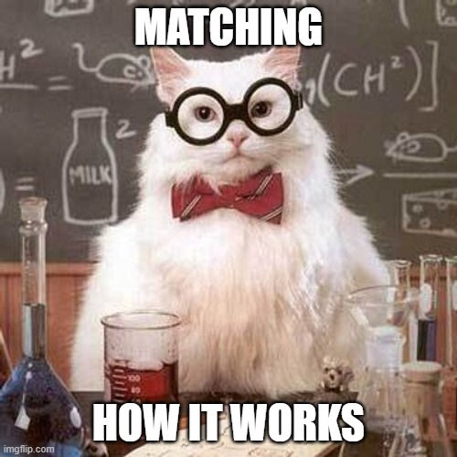

<style>
body {
text-align: justify}
</style>


```{r setup, include=FALSE, results='hide', warning=FALSE}
library(knitr)
opts_chunk$set(cache = FALSE,
               echo = TRUE,
               message = FALSE,
               warning = FALSE,
               dpi = 300)  
``` 

```{marginfigure}

```

In this document, we will see why matching is a powerful non-parametric method to pre-process the data before moving to the analysis. 

In a famous article, Lalonde (1986) showed that statistical methods used at that time were unable to produce similar results as those found with randomized controlled trials. To do so, he retrieved the experimental data from the National Supported Work Demonstration. Using this dataset, he had a good estimate of the true causal effect of the program. He then kept the observations on treated individuals and added an observational control group from the Current Population Survey (CPS). An analysis based on multivariate regression model was unable to retrieve the same estimate found initially with the experimental data.

However, a decade later, Dehejia and Wahha (1999) used a propensity score matching to show that this method could better approximate the results of the RCT.

We will replicate both analyses.

Should you find any errors and have any remarks, do not hesitate to reach me at leo.zabrocki@gmail.com.

# Loading Packages

To build the document and reproduce the analysis, the following packages are required: 

```{r}
library(here) # for file paths management
library(knitr) # for generating dynamic report
library(tidyverse) # for data manipulation and visualization
library(MatchIt) # for matching algorithms
library(cobalt) # for matching diagnostics
library(lalonde) # for lalonde and psid data
library(lmtest) # for modifying regression standard errors
library(sandwich) # for robust and cluster robust standard errors
library(Cairo) # for printing external fonts
source(here::here("script_theme_tufte.R")) # custom ggplot theme

# define nice colors
my_blue <- "#0081a7"
my_orange <- "#fb8500"
```

To install the `lalonde` package which is not on CRAN, you need to retrieve it from GitHub:

```{r, eval = FALSE}
# install lalonde package
devtools::install_github("jjchern/lalonde")
```

# Analysis of the Experimental Data

We load the experimental dataset used by Dehejia and Wahha (1999):

```{r}
# load experimental data
experimental_data <- lalonde::nsw_dw
```

The data contains observations on `nrow(experimental_data)` individuals, with information on their treatment status (`treat`), age (`age`), years of education (`education`), their ethnicity (`black` and `hispanic`), their marital status (`married`), if they obtained an high school degree (`nodegree`), their earnings before the experiment (`re74` and `re75`) and after (`re78`).

We can first check how the treatment was divided:

```{r}
experimental_data %>%
  group_by(treat) %>%
  summarise(n = n())
```

We can see that there are more individuals that were assigned to the control group than the treatment group.

## Checking Balance

Before analyzing experiment data, it is very important to check if randomization was successful to balance the observed covariates. We can start by computing proportions for binary variables by treatment groups:

```{r}
experimental_data %>%
  pivot_longer(cols = c(black:nodegree), names_to = "binary_covariate", values_to = "value") %>%
  group_by(binary_covariate, treat) %>%
  summarise(proportion = round(mean(value)*100, 1))
```

We can see that the randomization was not perfect for `hispanic` and `nodegree`. For `age`, we can also compute the proportion of observations for each age and by groups:

```{r, fig.height=5, fig.width=8}
experimental_data %>%
  mutate(treat = ifelse(treat==1, "Treated", "Control")) %>%
  group_by(treat, age) %>%
  summarise(n = n()) %>%
  mutate(freq = round(n / sum(n)*100, 1)) %>%
  ggplot(., aes(x=as.factor(age), y = freq, colour = treat)) +
  geom_line(aes(group = age), colour = "black") +
  geom_point() +
  scale_colour_manual(values = c(my_blue, my_orange)) +
  theme_tufte() +
  labs(title = "Checking Balance for Age", x = "Age", y = "Proportion (%)", colour = "Group:")
```

The `age` variable seems relatively well-balanced. We can proceed in the same manner for the `education` variable:

```{r, fig.height=5, fig.width=8}
experimental_data %>%
  mutate(treat = ifelse(treat==1, "Treated", "Control")) %>%
  group_by(treat, education) %>%
  summarise(n = n()) %>%
  mutate(freq = round(n / sum(n)*100, 1)) %>%
  ggplot(., aes(x=as.factor(education), y = freq, colour = treat)) +
  geom_line(aes(group = education), colour = "black") +
  geom_point() +
  scale_colour_manual(values = c(my_blue, my_orange)) +
  scale_y_continuous(breaks = scales::pretty_breaks(n = 10)) +
  theme_tufte() +
  labs(title = "Checking Balance for Education", x = "Age", y = "Proportion (%)", colour = "Group:")
```

Again, the `education` variable is balanced, with the exception of 10 years of education. Finally, we can check that the previous revenues (`re74` and `re75`) are balanced:

```{r, fig.height=5, fig.width=8}
experimental_data %>%
  mutate(treat = ifelse(treat == 1, "Treated", "Control")) %>%
  pivot_longer(cols = c(re74, re75),
               names_to = "previous_revenues",
               values_to = "value") %>%
  mutate(previous_revenues = ifelse(previous_revenues == "re74", "Revenue in 1974", "Revenue in 1975")) %>%
  ggplot(., aes(x = value, colour = treat)) +
  geom_density() +
  scale_colour_manual(values = c(my_blue, my_orange)) +
  scale_x_continuous(breaks = scales::pretty_breaks(n = 10)) +
  facet_wrap( ~ previous_revenues) +
  theme_tufte() +
  labs(
    title = "Checking Balance for Previous Revenus",
    x = "Revenue ($)",
    y = "Density",
    colour = "Group:"
  )
```

Once the balanced is checked, we can move to the analysis. 

## Fisherian Inference

As seen in the previous class, we could first test the sharp null hypothesis of no effect. We first compute a permutations matrix of the treatment allocation:

```{r}
permutations_matrix <- replicate(10000 , sample(experimental_data$treat, replace = FALSE))
```

We then compute the observed difference in means:

```{r}
obs_difference <- mean(experimental_data$re78[experimental_data$treat==1]) - mean(experimental_data$re78[experimental_data$treat==0])
```

In the treatment group, they have, on average, a higher revenue by `r round(obs_difference,0)`$. We finally compute the distribution of this test statistic:

```{r}
# randomization distribution
randomization_distribution = NULL
n_columns = dim(permutations_matrix)[2]
for (i in 1:n_columns) {
  permuted_test_statistic = mean(experimental_data$re78[permutations_matrix[, i] == 1]) - mean(experimental_data$re78[permutations_matrix[, i] == 0])
  randomization_distribution[i] = permuted_test_statistic
}
```

And plot the distribution:

```{r, fig.height=5, fig.width=8}
data_randomization_distribution <-
  tibble(diff_sim = randomization_distribution) 

ggplot(data_randomization_distribution, aes(x = diff_sim)) +
  geom_histogram(color = "white", fill = my_blue, alpha = 0.8) +
  geom_vline(xintercept = mean(data_randomization_distribution$diff_sim), color = "black") +
  geom_vline(xintercept = obs_difference, color = my_orange) +
  ggtitle("Distribution of the Test Statistic under the Sharp Null Hypothesis") +
  xlab("Estimated Test Statistics") + ylab("Count") +
  theme_tufte()
```

Clearly, it seems we can reject the sharp null hypothesis of no effect.

## Estimating the ATE

However, it is more interesting to estimate the average treatment effect. We can use a simple regression model where we regress the outcome on the treatment:

```{r}
# we fit the regression model
model_experiment <-
  lm(
    re78 ~ treat,
    data = experimental_data
  )

# retrieve the estimate and 95% ci
results_model_experiment <- broom::tidy(coeftest(
  model_experiment,
  vcov. = vcovHC), conf.int = TRUE) %>%
  filter(term == "treat") %>%
  select(term, estimate, conf.low, conf.high) %>%
  mutate_at(vars(estimate:conf.high), ~ round(., 0))

# display results
results_model_experiment %>%
  rename(
    "Term" = term,
    "Estimate" = estimate,
    "95% CI Lower Bound" = conf.low,
    "95% CI Upper Bound" = conf.high
  ) %>%
  kable(., align = c("l", "c", "c", "c"))
```

Please interpret the results.

# Analysis of the Observational Data

We first construct the observational data:

```{r}
observational_data <- lalonde::nsw_dw %>% 
    filter(treat == 1) %>% 
    bind_rows(lalonde::cps_controls) %>% 
    select(-data_id)
```

The division of units is now as follows:

```{r}
observational_data %>%
  group_by(treat) %>%
  summarise(n = n())
```

## Naive analysis

If we do the same analysis as for the experimental data, we find:

```{r}
# we fit the regression model
model_obs_1 <-
  lm(
    re78 ~ treat,
    data = observational_data
  )

# retrieve the estimate and 95% ci
results_model_obs_1 <- broom::tidy(coeftest(
  model_obs_1,
  vcov. = vcovHC), conf.int = TRUE) %>%
  filter(term == "treat") %>%
  select(term, estimate, conf.low, conf.high) %>%
  mutate_at(vars(estimate:conf.high), ~ round(., 0))

# display results
results_model_obs_1 %>%
  rename(
    "Term" = term,
    "Estimate" = estimate,
    "95% CI Lower Bound" = conf.low,
    "95% CI Upper Bound" = conf.high
  ) %>%
  kable(., align = c("l", "c", "c", "c"))
```

We find completly a different result! As the treatment was not randomly assigned, we should try to adjust for observed confounders in the regression model:

```{r}
# we fit the regression model
model_obs_2 <-
  lm(
    re78 ~ treat + age + education + black + hispanic + married + nodegree + re74 + re75,
    data = observational_data
  )

# retrieve the estimate and 95% ci
results_model_obs_2 <- broom::tidy(coeftest(
  model_obs_2,
  vcov. = vcovHC), conf.int = TRUE) %>%
  filter(term == "treat") %>%
  select(term, estimate, conf.low, conf.high) %>%
  mutate_at(vars(estimate:conf.high), ~ round(., 0))

# display results
results_model_obs_2 %>%
  rename(
    "Term" = term,
    "Estimate" = estimate,
    "95% CI Lower Bound" = conf.low,
    "95% CI Upper Bound" = conf.high
  ) %>%
  kable(., align = c("l", "c", "c", "c"))
```

Again, the result is still different. Why? The covariates of the two groups are very different as shown by the following stats:

```{r}
observational_data %>%
  pivot_longer(cols = c(black:nodegree), names_to = "binary_covariate", values_to = "value") %>%
  group_by(binary_covariate, treat) %>%
  summarise(proportion = round(mean(value)*100, 1))
```

For previous revenues:

```{r, fig.height=5, fig.width=8}
observational_data %>%
  mutate(treat = ifelse(treat == 1, "Treated", "Control")) %>%
  pivot_longer(cols = c(re74, re75),
               names_to = "previous_revenues",
               values_to = "value") %>%
  mutate(previous_revenues = ifelse(previous_revenues == "re74", "Revenue in 1974", "Revenue in 1975")) %>%
  ggplot(., aes(x = value, colour = treat)) +
  geom_density() +
  scale_colour_manual(values = c(my_blue, my_orange)) +
  scale_x_continuous(breaks = scales::pretty_breaks(n = 10)) +
  facet_wrap( ~ previous_revenues) +
  theme_tufte() +
  labs(
    title = "Checking Balance for Previous Revenus",
    x = "Revenue ($)",
    y = "Density",
    colour = "Group:"
  )
```

The lack of overlap in covariates implies that the regression model will suffer from extrapolation bias: in the data, there are conrol units without empirical counterfactuals.


## First Matching 

A solution to overcome this problem is to use a matching algorithm to prune units which are not similar to the treated units. We could for instance try to match extactly treated and control units for a set of covariates:

```{r}
# exact matching 1
matching_exact_1 <-
  matchit(
    treat ~ age + black + hispanic + married + education + re74 + re75,
    data = observational_data,
    method = "exact"
  )

# display summary of the procedure
matching_exact_1
```

## Second Matching analysis

We will rely now on propensity score matching where the goal is (i) to predict for each unit the probability of taking the treatment according to the observed covariates and (ii) match treated and control units according to the proximity of their propensity scores. Here is how to do it:

```{r}
# match without caliper
matching_ps <-
  matchit(
    treat ~ age + education + black + hispanic + married + nodegree + re74 + re75,
    data = observational_data
  )

# display summary of the procedure
matching_ps
```
We see that all 185 treated units were matched to their closest control units. We can plot the distribution of propensity scores:

```{r, fig.height=5, fig.width=8}
# distribution of propensity scores
bal.plot(
  matching_ps,
  var.name = "distance",
  which = "both",
  sample.names = c("Initial Data", "Matched Data"),
  type = "density") +
  ggtitle("Distribution of the Propensity Score Before and After Matching") +
  xlab("Propensity Scores") +
  scale_fill_manual(
    name = "Group:",
    values = c(my_blue, my_orange),
    labels = c("Treated", "Control")
  ) +
  theme_tufte()
```

The overlap of the propensity scores is now nearly perfect. We can make a love plot to better check the balance:

```{r, fig.height=5, fig.width=8}
# make the love plot
love.plot(
  matching_ps,
  drop.distance = TRUE,
  abs = TRUE,
  var.order = "unadjusted",
  binary = "raw",
  s.d.denom = "treated",
  thresholds = c(m = .1),
  sample.names = c("Initial Data", "Matched Data"),
  shapes = c("circle", "triangle"),
  colors = c(my_orange, my_blue),
  stars = "std"
) +
  scale_x_continuous(breaks = scales::pretty_breaks(n = 10)) +
  xlab("Absolute Mean Differences") +
  theme_tufte()
```

We can then estimate the treatment effect. By pruning control units, we are focusing on a different causal estimand than the average treatment effect: the average treatment on the treated.

```{r}
# we retrieve the matched data
data_matching_ps <- match.data(matching_ps)

# we fit the regression model
model_ps <-
  lm(
    re78 ~ treat + age + education + black + hispanic + married + nodegree + re74 + re75,
    data = data_matching_ps,
    weights = weights
  )

# retrieve the estimate and 95% ci
results_ps <- broom::tidy(coeftest(model_ps,
                            vcov. = vcovCL,
                            cluster = ~ subclass),
                   conf.int = TRUE) %>%
  filter(term == "treat") %>%
  select(term, estimate, conf.low, conf.high) %>%
  mutate_at(vars(estimate:conf.high), ~ round(., 0))

# display results
results_ps %>%
  rename(
    "Term" = term,
    "Estimate" = estimate,
    "95% CI Lower Bound" = conf.low,
    "95% CI Upper Bound" = conf.high
  ) %>%
  kable(., align = c("l", "c", "c", "c"))
```

## Third Matching analysis

In this second analysis, we try to be more strict for the distance metric used in the matching procedure. Researchers often use the caliper, which is the standard deviation of the propensity. Here we will not allow a treated unit to be matched to a control unit for caliper values above 0.5.

```{r}
# match without caliper
matching_ps_caliper <-
  matchit(
    treat ~ age + education + black + hispanic + married + nodegree + re74 + re75,
    caliper = 0.1,
    data = observational_data
  )

# display summary of the procedure
matching_ps_caliper
```

We see that 174 treated units were matched to their closest control units. We can plot the distribution of propensity scores:

```{r, fig.height=5, fig.width=8}
# distribution of propensity scores
bal.plot(
  matching_ps_caliper,
  var.name = "distance",
  which = "both",
  sample.names = c("Initial Data", "Matched Data"),
  type = "density") +
  ggtitle("Distribution of the Propensity Score Before and After Matching") +
  xlab("Propensity Scores") +
  scale_fill_manual(
    name = "Group:",
    values = c(my_blue, my_orange),
    labels = c("Treated", "Control")
  ) +
  theme_tufte()
```

The overlap is excellent. We can make a love plot to better check the balance:

```{r, fig.height=5, fig.width=8}
# make the love plot
love.plot(
  matching_ps_caliper,
  drop.distance = TRUE,
  abs = TRUE,
  var.order = "unadjusted",
  binary = "raw",
  s.d.denom = "treated",
  thresholds = c(m = .1),
  sample.names = c("Initial Data", "Matched Data"),
  shapes = c("circle", "triangle"),
  colors = c(my_orange, my_blue),
  stars = "std"
) +
  scale_x_continuous(breaks = scales::pretty_breaks(n = 10)) +
  xlab("Absolute Mean Differences") +
  theme_tufte()
```

We can then estimate the treatment effect. It is now very important to understand the targeted causal estimand is no longer the the average treatment on the treated but a subset of it.

```{r}
# we retrieve the matched data
data_matching_ps_caliper <- match.data(matching_ps_caliper)

# we fit the regression model
model_ps_caliper <-
  lm(
    re78 ~ treat + age + education + black + hispanic + married + nodegree + re74 + re75,
    data = data_matching_ps_caliper,
    weights = weights
  )

# retrieve the estimate and 95% ci
results_ps_caliper <- broom::tidy(coeftest(model_ps_caliper,
                            vcov. = vcovCL,
                            cluster = ~ subclass),
                   conf.int = TRUE) %>%
  filter(term == "treat") %>%
  select(term, estimate, conf.low, conf.high) %>%
  mutate_at(vars(estimate:conf.high), ~ round(., 0))

# display results
results_ps_caliper %>%
  rename(
    "Term" = term,
    "Estimate" = estimate,
    "95% CI Lower Bound" = conf.low,
    "95% CI Upper Bound" = conf.high
  ) %>%
  kable(., align = c("l", "c", "c", "c"))
```

Can you interpret this result?
